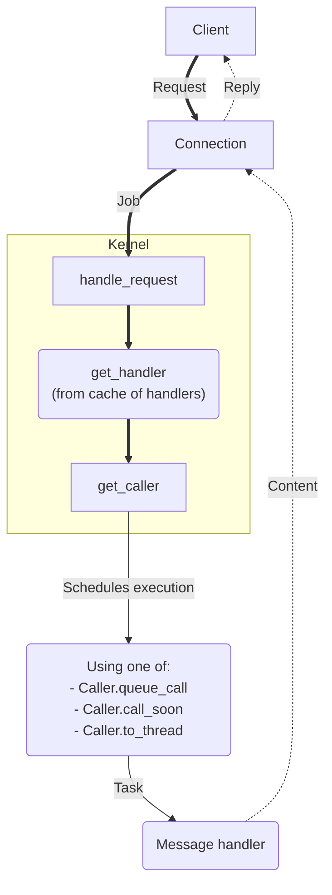

--8<-- "README.md"

## How it works

async-kernel provides concurrent message handling using a per-msg_type handlers and
[Caller][async_kernel.caller.Caller] to run the handlers.

When a connection receives a message it wraps the message in a `Job` and calls
`Kernel.handle_request`. The kernel gets a handler for the job and decides a `Caller`
to use. One of three methods on the Caller is used to run the `Job` in the handler.

- [`queue_call` (default)][async_kernel.caller.Caller.queue_call]: A single task
  is created for the `handler` which maintains a queue and executes jobs first-in-first-out.
- [`call_soon`][async_kernel.caller.Caller.call_soon]: A new task is created for
  the `handler` and `Job`.
- [`to_thread`][async_kernel.caller.Caller.to_thread]: A worker caller thread is used to
  run the `handler` with the `Job`.

Execute requests [can modify how the handler is run](./notebooks/async_kernel/#execute-request-run-mode).

