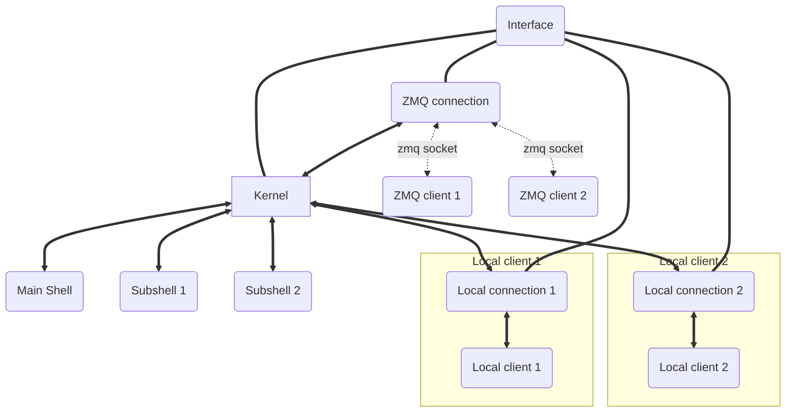

# Reference

The reference section provides documentation for each module in async-kernel.

## Interface

The interface is a singleton that acts as a single point of truth. It provides `Traitlets`
style configuration, starts the kernel and hosts connections.

The diagram below illustrates the relationship between various objects.

- Arrows represent messaging.
- Thick lines represent the current process.
- Serialized messages and illustrated by a dotted line.

## Highlights

- [Interface][async_kernel.interface.Interface] - The kernel interface.
- [Kernel][async_kernel.kernel.Kernel] - The kernel.
- [Caller][async_kernel.caller.Caller] - A flexible interface for scheduling work across threads and asynchronous backends.
- [command_line][async_kernel.command.command_line] - The command line interface.
